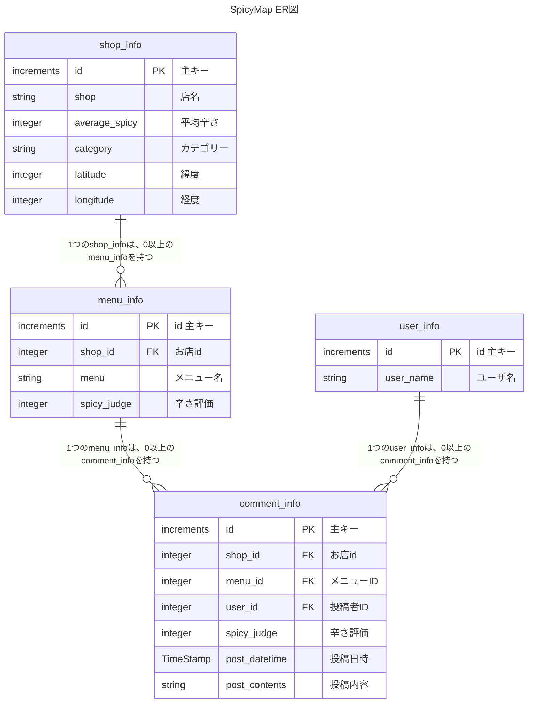

# SpicyMap

```mermaid
---
title: "SpicyMap ER図"
---
erDiagram

shop_info {
    increments id PK "主キー"
    string shop "店名"
    integer average_spicy "平均辛さ"
    string category "カテゴリー" 
    integer latitude "緯度"
    integer longitude "経度"
}

menu_info {
    increments id PK "id 主キー"
    integer shop_id FK "お店id"
    string menu "メニュー名"
    integer spicy_judge "辛さ評価"
}


comment_info {
    increments id PK "主キー"
    integer shop_id FK "お店id"
    integer menu_id FK "メニューID"
    integer user_id FK "投稿者ID"
    integer spicy_judge "辛さ評価"
    TimeStamp post_datetime "投稿日時" 
    string post_contents "投稿内容"
}

user_info {
    increments id PK "id 主キー"
    string user_name "ユーザ名"
}

shop_info ||--o{ menu_info : "1つのshop_infoは、0以上のmenu_infoを持つ"
menu_info ||--o{ comment_info : "1つのmenu_infoは、0以上のcomment_infoを持つ"
user_info ||--o{ comment_info : "1つのuser_infoは、0以上のcomment_infoを持つ"
```