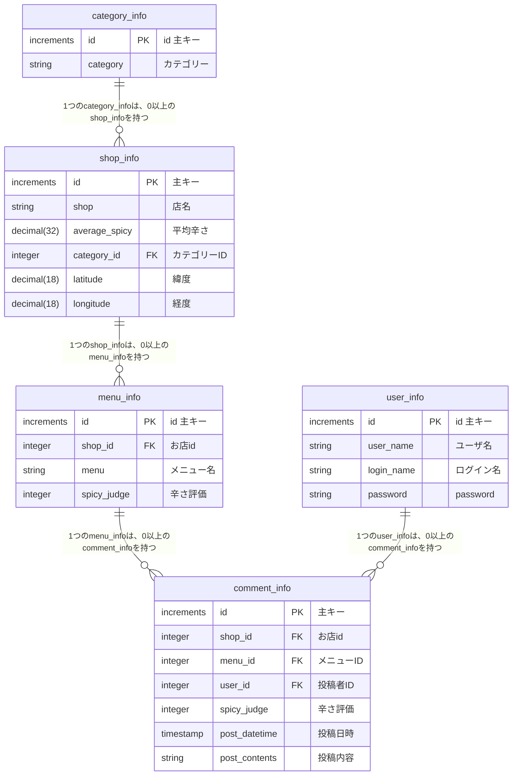

# SpicyMap

## DB名
spicy_map



# ローカル環境構築手順
1. このリポジトリをクローン
2. spicy_mapテーブルを構築
3. frontendディレクトリ直下に.envファイルを作成
4. backendディレクトリ直下に.envファイルを作成
5. プロジェクトルートで npm run build

## frontendディレクトリ直下の.envファイル
```
VITE_API_KEY=GoogleマップのAPIキーを取得してください
VITE_API_URL=http://localhost:8080
```

## GoogleマップAPIのキーについて
GoogleマップAPIのキーは、Google Cloud Platformで取得してください。
https://qiita.com/Haruka-Ogawa/items/997401a2edcd20e61037

## backendディレクトリ直下の.envファイル
```
DB_NAME=spicy_map
DB_USER=user
DB_PASSWORD=
NODE_ENV=development
PORT=8080
```